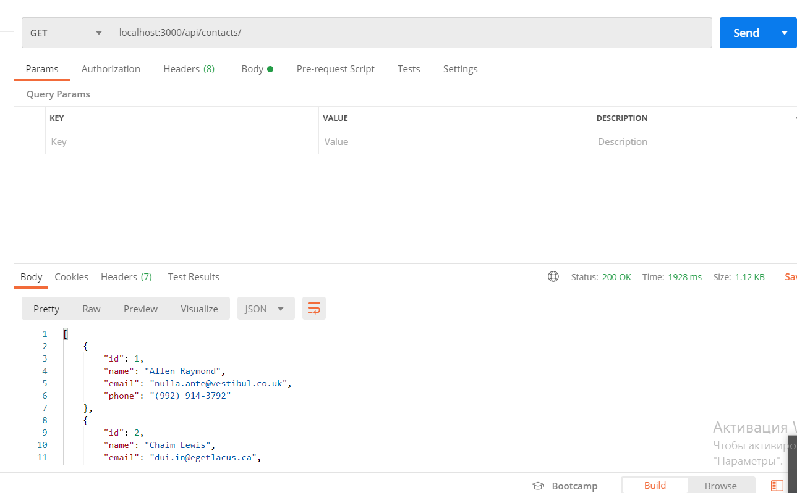
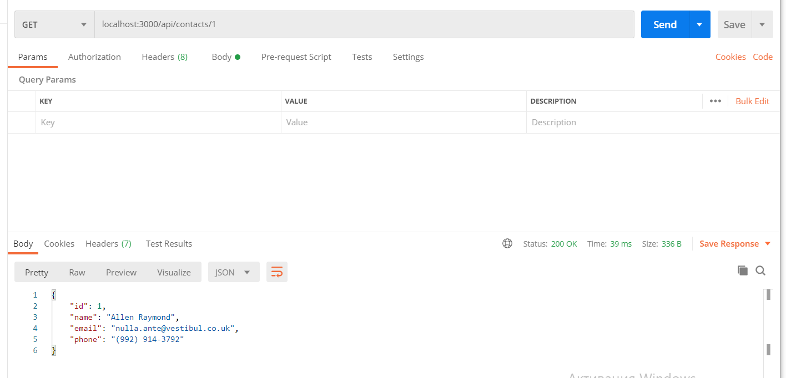
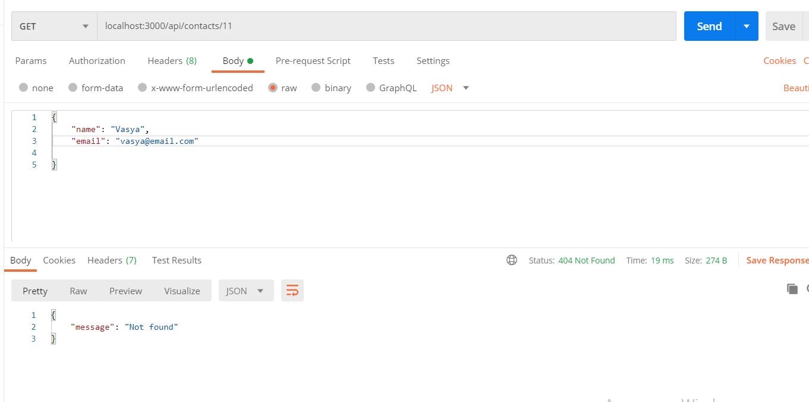
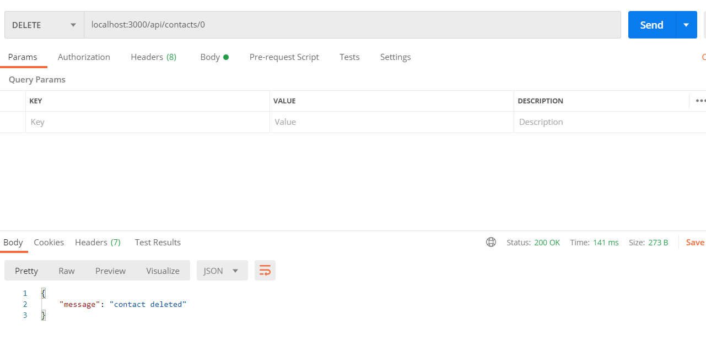
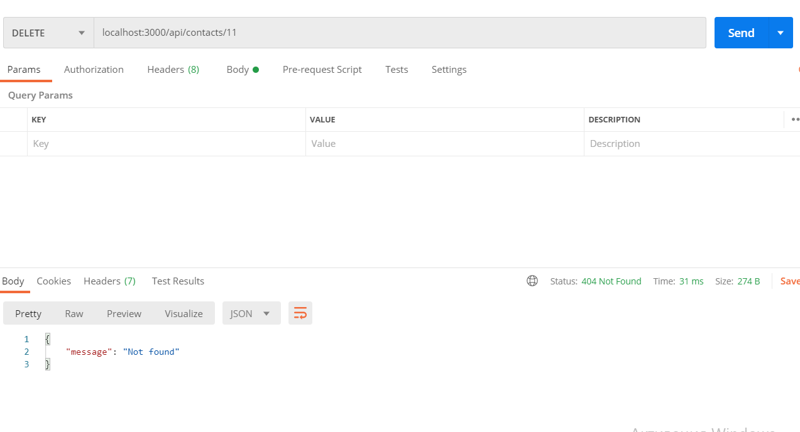
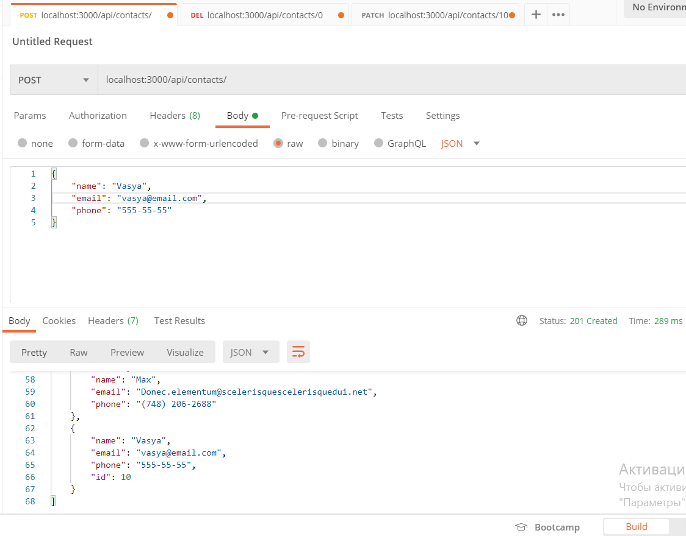
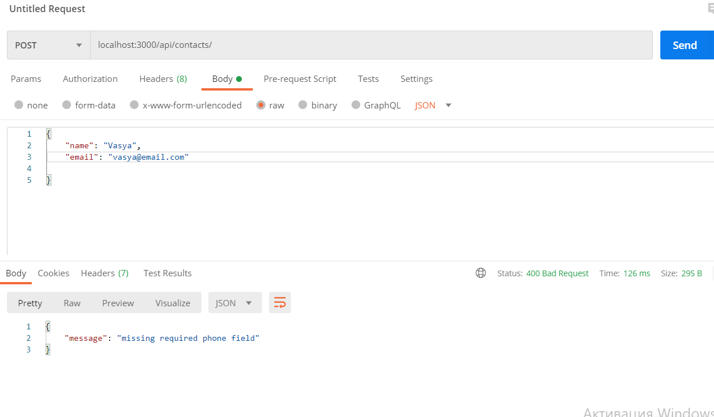
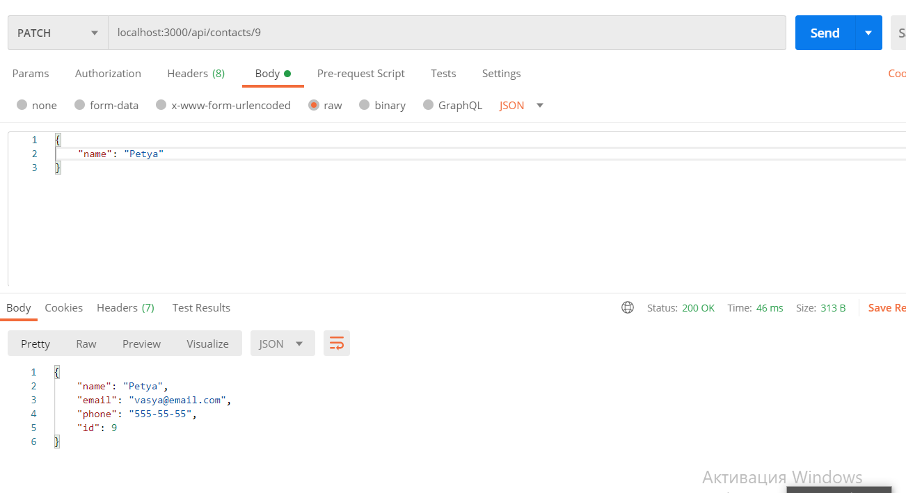
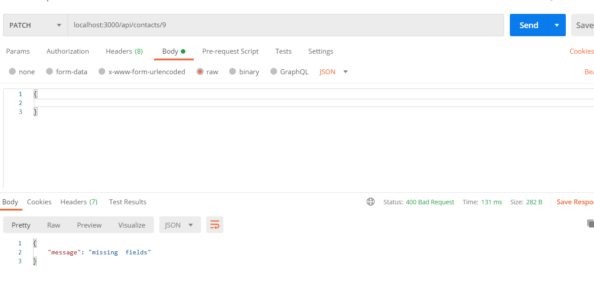
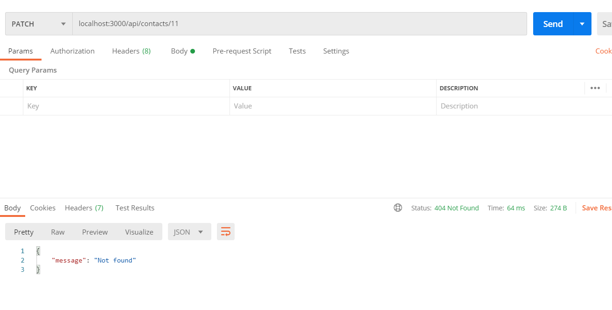

# goit-nodejs23-homeworks

# 02-express

// get-contacts

// get-contact-byid

// get-contact-byid-not-found

// delete-contact-succese

// delete-contact-notFound

// post-contact

// post-contact-missingField

// patch-ok

// patch-missing

// patch-not-found

